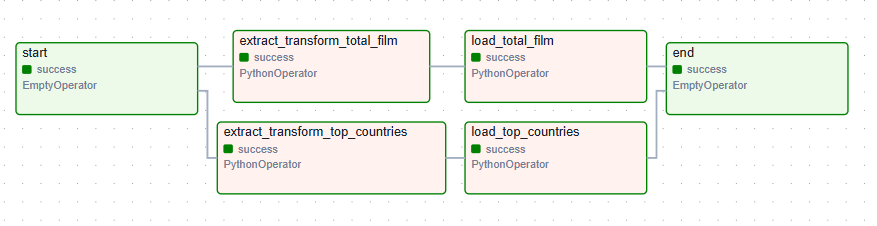

# Project3

## 📖 Deskripsi Proyek
Project3 adalah proyek data pipeline yang memanfaatkan Apache Airflow, Apache Spark, dan Docker untuk membangun alur kerja otomatisasi data yang scalable. 

Proyek ini dirancang untuk:
Ekstraksi data dari sumber.
Transformasi menggunakan Spark.
Orkestrasi menggunakan Airflow untuk pengelolaan workflow.

## 🌟 Graph DAG

## ⚙️ Cara Menjalankan Proyek
1. buat .env
2. docker volume create postgres_airflow
3. docker build -t my-airflow . 
4. docker compose up

